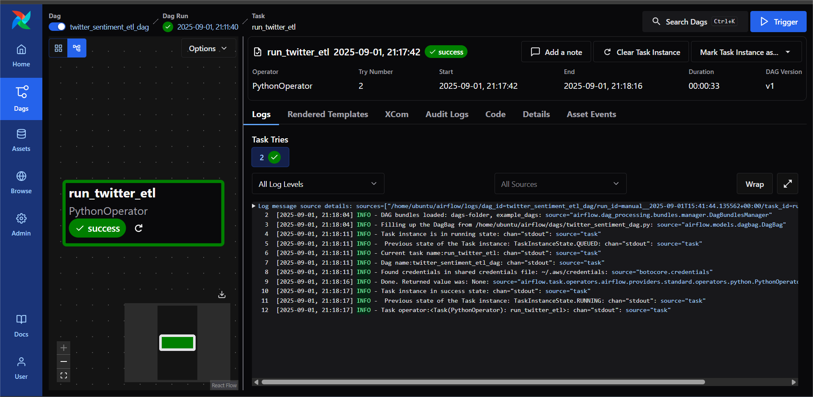

# dataengineering-twitter-etl-pipeline-airflow--som
# Twitter Sentiment ETL Pipeline with Apache Airflow

## Project Overview

This repository contains a complete ETL pipeline for sentiment analysis of Twitter data, managed and automated using Apache Airflow. The workflow retrieves raw tweet data from AWS S3, cleans and transforms it using Python, and produces a processed output. All steps are coordinated by a custom Airflow DAG.

## Included Files

- **Tweet_data_cleaned.csv** — Final processed and cleaned Twitter data.
- **Tweets_data.csv** — Original raw Twitter dataset downloaded from S3.
- **etl_twitter_sentiment.py** — Python script for extracting, cleaning, and saving sentiment data.
- **twitter_commands.sh** — Shell script to assist with setup or SCP file transfers.
- **twitter_sentiment_dag.py** — The Airflow DAG definition for pipeline orchestration.
- **twitter_sentiment_etl_dag-graph.png** — Screenshot of DAG workflow graph for documentation.
- **README.md** — Documentation and instructions for setup and usage.

---

## How the Pipeline Works

1. **ETL Script (`etl_twitter_sentiment.py`):**  
   - Downloads the raw dataset from AWS S3.  
   - Cleans the tweets using pandas and performs sentiment preprocessing.  
   - Exports the output to `Tweet_data_cleaned.csv`.

2. **Airflow DAG (`twitter_sentiment_dag.py`):**  
   - Manages, schedules, and triggers the ETL script with PythonOperator.  
   - Provides retry, logging, and status monitoring for reliability.

3. **File Transfer:**  
   - Uses `twitter_commands.sh` or SCP to securely download the cleaned output from EC2.

---

## Screenshots

### Airflow DAG Workflow  

---

## Usage Instructions

1. Clone the repository and place files in your Airflow DAGs home or project folder.
2. Configure AWS credentials on your EC2 instance for S3 access.
3. Open Airflow’s UI, enable and trigger the DAG to run the pipeline.
4. After successful run, download `Tweet_data_cleaned.csv` using the provided shell script or SCP command.
5. Analyze the result file in Excel, pandas, or any data analysis tool.

---

## Security Notice

Do **NOT** upload, share, or include your `.pem` credentials file or any AWS secrets in this repository.

---

This project provides a robust, modular workflow for data engineers seeking practical Airflow automation and S3-based ETL integration.
